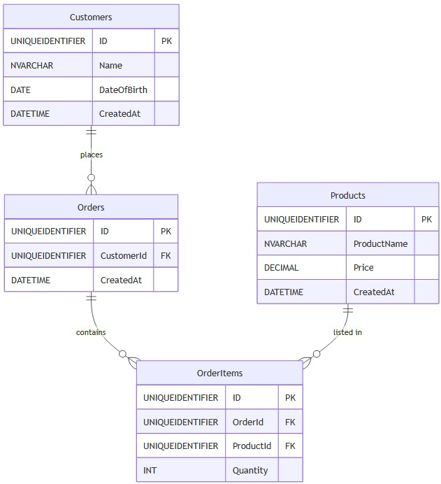

# SQL load testing project

This project is designed to facilitate load testing for a Microsoft SQL Server 2022 database. The primary goal is to create a local database named **LoadTestingDb** that can efficiently handle millions or billions of rows.

  

## Project Structure

- **scripts/**: Contains SQL scripts for setting up the database, generating test data, and running tests.
  - **setup/**: Scripts to create the database, schema, and indexes.
  - **data/**: Scripts for generating and importing test data.
  - **tests/**: Scripts for executing query and performance tests.

- **config/**: Contains configuration files for database connection settings.

- **results/**: Documentation of the results from the load tests.

## Getting Started

1. **Database Setup**:
   - Run `CreateDatabase.sql` to create the LoadTestingDb database.
   - Execute `CreateSchema.sql` to define the database schema.
   - Use `CreateIndexes.sql` to create necessary indexes for performance optimization.

2. **Data Generation**:
   - Execute `GenerateTestData.sql` to populate the database with a large volume of test data.
   - Use `ImportProcedures.sql` for any additional data import needs.

3. **Testing**:
   - Run `QueryTests.sql` to evaluate the performance and correctness of various queries.
   - Execute `PerformanceTests.sql` to measure the database performance under different load conditions.

The location of the database files is `C:\Program Files\Microsoft SQL Server\MSSQL16.MSSQLSERVER\MSSQL\DATA`

## Results

After running the tests, refer to the `results/README.md` for detailed findings, metrics, and recommendations based on the load testing outcomes.

## Contributing

Contributions to improve the load testing process and scripts are welcome. Please follow the guidelines for submitting changes.